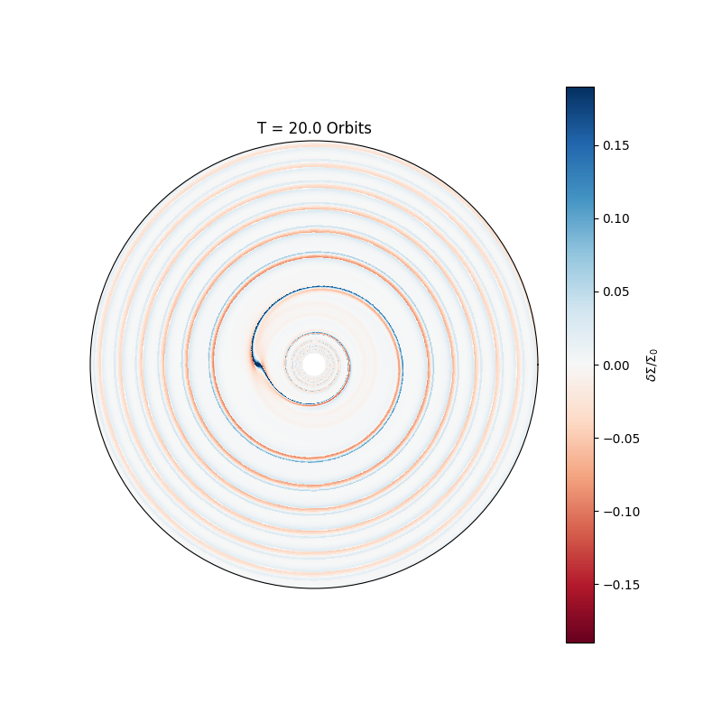

## Amelia Cordwell's Research Page
Hello! I am a PhD student in the Department of Applied Mathematics and Theoretical Physics at the University of Cambridge, under the supervison of Roman R. Rafikov.

My research focuses on planet-disc interactions in protoplanetary discs using a mixture of simulations and analytic work.

Any queries related to my research work should be sent to ajc356 (at) cam.ac.uk. 

### Research Overview

Evolution of surface density for a disc with a $M_p/M_{th} = 0.25$ planet, $h_p = 0.05$ and $\Sigma_0 = (R/R_p)^{-1.5}$.

The first paper of my PhD, [Early stages of gap opening by planets in protoplanetary discs (Cordwell & Rafikov, 2024)](https://arxiv.org/abs/2407.01728), is available as a preprint on ArXiv and has been published by MNRAS. 

### Cambridge Astrophysical Discs Early Career Researcher Meetups 

I sometimes try to organise meetups for all of the astrophysical disc researchers in Cambridge.

If you are currently in Cambridge, and logged into your .cam.ac.uk Google account you will be able to access some related resources and a researcher directory [here](https://drive.google.com/drive/folders/1HCV1TIXHKnUQcjfWwMuWnGpBedOooGSI?usp=drive_link).

### Available codes and data

[Vortensity Driven Evolution of Protoplanetary Discs](https://github.com/cordwella/vortensity_evolution)
This is an implementation of the semi-analytical angular momentum deposition model from Cimerman and Rafikov (2021) and its related surface density reconstruction algorithm from Cimerman and Rafikov (2023). It models the initial evolution of a disc with an injected sub-thermal mass protoplanet. The vortensity solver can solve for surface densities with an arbitary perscribed vortensity in a barotropic disc. It also includes implementations of the surface density evolution solutions from Cordwell & Rafikov, 2024.

### Previous publications (from undergraduate/honours projects)
- [Asteroid Lightcurves from the MOA-II Survey: a pilot study (2022)](https://academic.oup.com/mnras/article/514/2/3098/6547784)
- [Ferrofluid drop impacts and Rosensweig peak formation in a non-uniform magnetic field (2023)](https://pubs.rsc.org/en/content/articlehtml/2023/sm/d3sm00701d)
