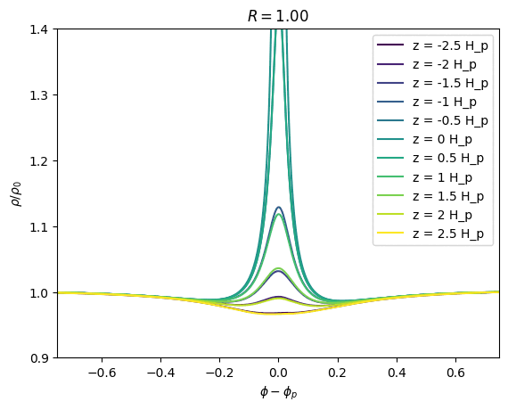

I research protoplanetary discs with a focus on planet-disc interactions, using simulations to verify and develop (semi-)analytical theory, an developing analytic theory to verify develop, and analyse better simulatons.

My full CV is available [here](CV_2025.pdf), and my full list of publications is on [Google Scholar](https://scholar.google.com/citations?hl=en&user=YrQSSzYAAAAJ).

### PhD Research Overview
The first paper of my PhD, [Early stages of gap opening by planets in protoplanetary discs (Cordwell & Rafikov, 2024)](https://arxiv.org/abs/2407.01728), is available as a preprint on ArXiv and has been published by MNRAS. My second paper [How two-dimensional are planet-disc interactions? I. Locally isothermal discs (Cordwell, Ziampras, Brown & Rafikov, 2025)](https://arxiv.org/abs/2509.04282) has been submitted to MNRAS. A third paper, focusing on the impacts of viscosity and cooling on angular momentum deposition, is in prep.

I am always happy to answer questions about my work over email: ajc356 (at) cam.ac.uk.

Surface density perturbation for a disc with a $` M_p/M_{th} = 0.25$ planet, $h_p = 0.1$ scale height at the planet and $\Sigma_0 = (R/R_p)^{-1.5} `$ background surface density (2D simulation).

3D structure of the excited planetary wake from a simulation with a $` M_p/M_{th} = 0.25`$ planet, $`h_p = 0.05`$ scale height at the planet and $`\Sigma_0 = (R/R_p)^{-1.5} `$ background surface density

### Scientific Codes on GitHub (All free and open source)
[disc_planet_analysis](https://github.com/cordwella/disc_planet_analysis): A python module for analysing the output of 2D and 3D planet-disc interaction simulations. This can currently automatically open 2D/3D Athena++ and PLUTO simulations. Outputs include total torque, expected gap evolution, angular momentum deposition, expected gap evolution (using the theory of Cordwell and Rafikov, 2024), horseshoe widths, vortensity and more. 

[Athena++ with Planet-Disc interactions](https://github.com/cordwella/athena-disk-planet) (WORK IN PROGRESS): A fork of Athena++ with problem files for planet-disc interactions, example athinput files as used in Cordwell, Ziampras, Brown and Rafikov (2025, in prep) and complimation commands for the University of Cambridge HPC systems. 

[Vortensity Driven Evolution of Protoplanetary Discs](https://github.com/cordwella/vortensity_evolution): 
This is an implementation of the semi-analytical angular momentum deposition model from Cimerman and Rafikov (2021) and its related surface density reconstruction algorithm from Cimerman and Rafikov (2023). It models the initial evolution of a disc with an injected sub-thermal mass protoplanet. The vortensity solver can solve for surface densities with an arbitary prescribed vortensity in a barotropic disc. It also includes implementations of the surface density evolution solutions from Cordwell and Rafikov (2024).

### Cambridge Astrophysical Discs Early Career Researcher Meetups 

I sometimes try to organise meetups for all of the astrophysical disc researchers in Cambridge.

If you are currently in Cambridge, and logged into your .cam.ac.uk Google account you will be able to access some related resources and a researcher directory [here](https://drive.google.com/drive/folders/1HCV1TIXHKnUQcjfWwMuWnGpBedOooGSI?usp=drive_link).

### Pre-PhD Publications
- [Asteroid Lightcurves from the MOA-II Survey: a pilot study (2022)](https://academic.oup.com/mnras/article/514/2/3098/6547784) (First Author)
- [Ferrofluid drop impacts and Rosensweig peak formation in a non-uniform magnetic field (2023)](https://pubs.rsc.org/en/content/articlehtml/2023/sm/d3sm00701d) (First Author)
