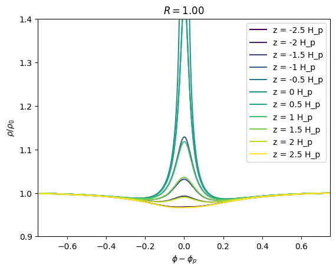

I research the astrophysical fluid dynamics of binary stars and protoplanetary discs.

My PhD at the University of Cambridge under the supervision of Prof. Roman Rafikov focused on planet-disc interactions, including using simulations to verify and develop (semi-)analytical theory, and developing analytic theory to support the creation of better simulations. Currently, I am a postdoctoral researcher working for Ondrej Pejcha at Charles University in Prague.

My full CV is available [here](CV_2025.pdf), and my full list of publications is on [Google Scholar](https://scholar.google.com/citations?hl=en&user=YrQSSzYAAAAJ).

I am always happy to answer questions about my work over email:  amelia-jane.cordwell (at) matfyz.cuni.cz

Surface density perturbation for a disc with a $` M_p/M_{th} = 0.25$ planet, $h_p = 0.1 `$ scale height at the planet and $` \Sigma_0 = (R/R_p)^{-1.5} `$ background surface density (2D simulation).

3D structure of the excited planetary wake from a simulation with a $` M_p/M_{th} = 0.25 `$ planet, $` h_p = 0.05 `$ scale height at the planet and $` \Sigma_0 = (R/R_p)^{-1.5} `$ background surface density

### Scientific Codes on GitHub (All free and open source)
[disc_planet_analysis](https://github.com/cordwella/disc_planet_analysis): A python module for analysing the output of 2D and 3D planet-disc interaction simulations. This can currently automatically open 2D/3D Athena++ and PLUTO simulations. Outputs include total torque, expected gap evolution, angular momentum deposition, expected gap evolution (using the theory of Cordwell and Rafikov, 2024), horseshoe widths, vortensity and more. 

[Athena++ with Planet-Disc interactions](https://github.com/cordwella/athena-disk-planet): A fork of Athena++ with problem files for planet-disc interactions, example athinput files as used in Cordwell, Ziampras, Brown and Rafikov and complimation commands for the University of Cambridge HPC systems. 

[Vortensity Driven Evolution of Protoplanetary Discs](https://github.com/cordwella/vortensity_evolution): 
This is an implementation of the semi-analytical angular momentum deposition model from Cimerman and Rafikov (2021) and its related surface density reconstruction algorithm from Cimerman and Rafikov (2023). It models the initial evolution of a disc with an injected sub-thermal mass protoplanet. The vortensity solver can solve for surface densities with an arbitary prescribed vortensity in a barotropic disc. It also includes implementations of the surface density evolution solutions from Cordwell and Rafikov (2024).